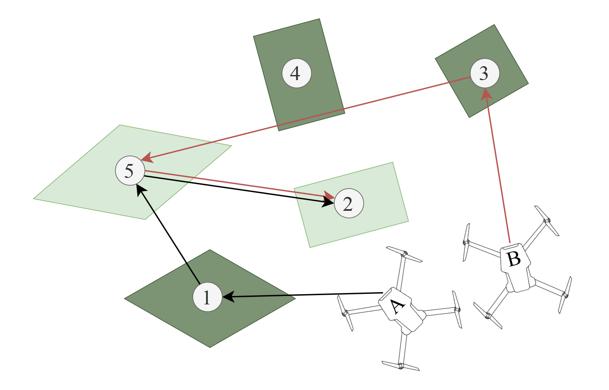
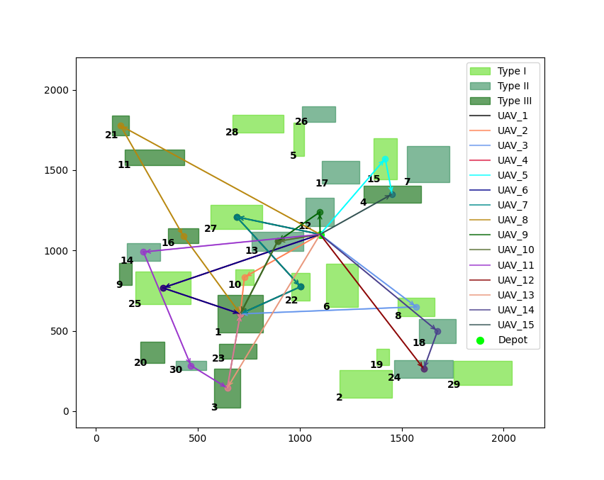

#### L-MA code repo
<center>

</center>

##### 1. Case format
```cpp
//center_point.x, center_point.y, field_size, max_col_num, field type, upper_left_point.x, upper_left_point.y, length, width
out <<node_list[i].center.x<<" "<<node_list[i].center.y<<" "<<node_list[i].size<<" "<<node_list[i].col_num<<" " <<node_list[i].type<<" "\
    << node_list[i].p1.x << " " << node_list[i].p1.y << " " << node_list[i].l_1 << " " << node_list[i].l_2 << endl;
```
you can build maps yourself with the code in map_build [dir]

##### 2. What you can do with the algorithm
<center>

